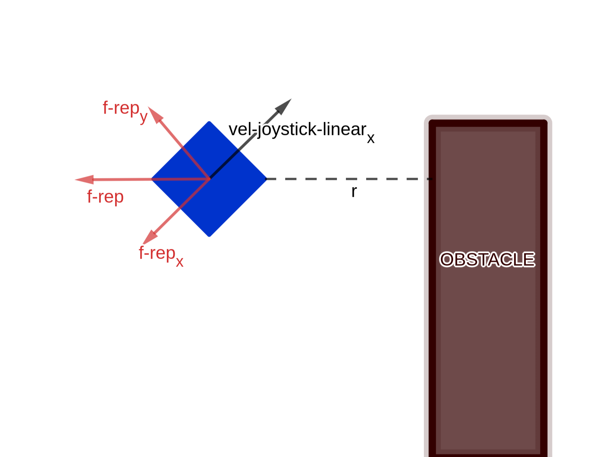
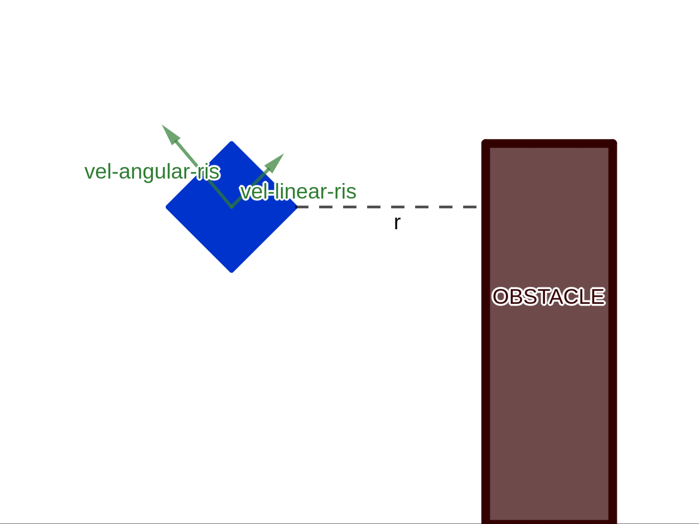
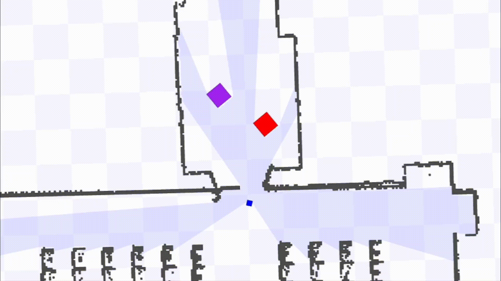

# COLLISION AVOIDANCE

### Sistema di un robot basato su laser che impedise le collisioni.

### Come funziona

Gli ostacoli creano forze repulsive che modificano la traiettoria del robot. Di seguito viene mostrato un esempio in cui viene data in input una certa velocità lineare e una velocità angolare nulla, con l'illustrazione dei vettori delle varie forze che vengono applicate dunque sul robot: una velocità angolare imposta dal joystick (nulla), una certa velocità lineare imposta dal joystick, una forza repulsiva generata dall'ostacolo a distanza r con le sue due componenti x e y

Le forze repulsive agiscono sulle velocità angolari e lineari ricevute dal joystick, modificandone i valori qualora gli ostacoli dovessero essere troppo vicini al robot. La nuova velocità lineare varrà 2 * k^2 * old_linear_vel, dove k varrà 1 se non ci sono ostacoli vicini al robot (*SAFE*), r/WARNING_CENTER_PARAM se l'ostacolo è vicino (*WARNING*) e 0 se l'ostacolo si trova **troppo** vicino al robot (*TRAP*).

Di seguito un esempio del funzionamento

## Passaggi da svolgere per testare il programma
1.  Aprire il terminale.

1.  Eseguire il comando `cd ~/your/path/lab-IAGI-project`.
	
1.  Eseguire `catkin build`.

1.  A questo punto avviare roscore utilizzando il comando `roscore`.

1.  Aprire un nuovo terminale, clonare la repository del corso di lab. IAGI dell'anno 2020-21, disponibile [qui](https://gitlab.com/grisetti/labiagi_2020_21)

1.  Eseguire `cd ~/your/path/labiagi_2020_21/`.

1.  Digitare `./setup.sh`.

1.  Eseguire `cd ~/your/path/labiagi_2020_21/workspaces/srrg2_labiagi/src/srrg2_navigation_2d/config`.

1.  Da qui, aprire un terminale per ogni punto ed eseguire questi comandi: (eseguire `source ~your/path/labiagi_2020_21/workspaces/srrg2_labiagi/devel/setup.bash` prima di eseguire i punti i e ii, mentre `source ~/your/path/lab-IAGI-project/devel/setup.bash` prima del punto iii.
	
	1.  `rosrun stage_ros stageros cappero_laser_odom_diag_obstacle_2020-05-06-16-26-03.world`  -> lancia il nodo /stageros e apre una finestra che mostra la navigazione del Robot sulla mappa
	
	1.  `rosrun srrg_joystick_teleop joy_teleop_node` -> lancia il nodo che manda messaggi del tipo geometry_msgs/Twist al nodo controller e che legge commandi dal dispositivo /opt/dev/js0. **N.B.**: Prima di eseguire quest'ultima istruzione, nel file 'joy_teleop_node.cpp' sostituire il nome del topic sul quale il nodo pubblica da '/cmd_vel' a '/vel_joystick'. La ragione di questa modifica sta nel fatto che si ha la necessità di distinguere il topic  (joy_teleop_node.cpp) --[Nome topic: /vel_joystick]--> (/collision_avoidance.cpp) dal topic (collision_avoidance.cpp) --[/cmd_vel]--> (stageros.cpp).
		  
	1.  `rosrun collision_avoidance collision_avoidance`    -> lancia il nodo /collision_avoidance che controlla il Robot per evitare gli ostacoli
	
	

Strumenti utili per il debug:
- `rosrun rqt_graph rqt_graph`  -> Grafico che mostra i nodi, i topic e la loro relazione;
- `rosmsg show <package>/<nome_messaggio>`  ->  Mostra la definizione del messaggio;
- `rosmsg  list` -> Mostra la lista di tutti i messaggi disponibili   ( `| grep <parte_del_messaggio>`   -> per filtrare i messaggi);
- `rostopic pub [-r] [frequenza(Hz)] <nome_topic> <tipo_messaggio>`   -> Pubblica da un certo topic;
- `rostopic echo <nome_topic> [-nNUM]`  -> Legge un topic [opzione dove si leggono solo i NUM ultimi messaggi];	
